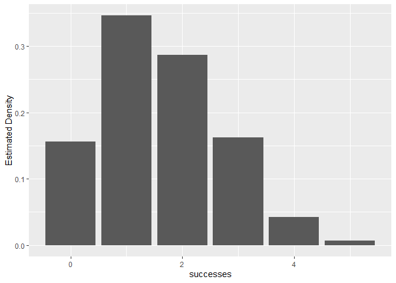

Module 2: Home Work
================
Lemi Daba
10/13/2020

Preamble
--------

For Questions 9 - 15, let
")
with 
and
.

For this section, please use this file for help with the R code. We
highly encourage you to look up the documentation on your own time.

Look at the `rbinom()` documentation to sample draws from this binomial
distribution. Use it to generate a vector called “successes” with 1000
draws from this distribution.

### Solution

``` r
successes <- rbinom(n = 1000, size = 8, prob = 0.2)
```

Question 9
----------

Suppose you saved the output of previous step as “successes”, which is a
numeric vector.

Please fill in the blank to write down a simplest base code to plot a
histogram of “successes”:

\_\_\_\_\_\_\_\_\_\_\_(**successes**)

### Answer

    hist(successes)

Question 10
-----------

Which of the following histograms is closest to the plot that you
created?

(The choices are not displayed here.)

### Answer

Running the previous code, we get

``` r
hist(successes)
```

<!-- -->

Looks like our result aligns most closely to the first choice.

Question 12
-----------

R has two other built-in functions related to the binomial random
variable. One is `dbinom()`, and the other is `pbinom()`. Look up these
functions, and use them to answer the questions below.

For parts A through C, suppose you flip an unfair coin, where $
p(heads)=0.65 $. **Round your answer to two decimal places. For
instance, if your answer is 0.467, please input 0.47**.

A. What is the probability of getting exactly 7 heads on 10 flips?

**Answer:**

``` r
round( dbinom(x = 7, size = 10, prob = 0.65), 2) 
```

    ## [1] 0.25

B. What is the probability of getting at most 7 heads on 10 flips?

**Answer:**

``` r
round( pbinom(q = 7, size = 10, prob = 0.65), 2) 
```

    ## [1] 0.74

C.What is the probability of getting at least 6 heads on 10 flips?

**Answer:**

``` r
round( pbinom(q = 5, size = 10, prob = 0.65, lower.tail = FALSE), 2) 
```

    ## [1] 0.75

or

``` r
round( 1 - pbinom(q = 5, size = 10, prob = 0.65), 2)
```

    ## [1] 0.75

Question 14
-----------

Admittedly, the histogram you generated in part 9 could use some work:
Firstly, we plotted the frequency counts as opposed to the observed
densities in our sample. Recall, that a probability function takes on
values between 0 and 1. Second, it is not very pretty to look at.

We found the code below, to plot the densities from the “successes”
vector you generated in part 9, however it is filled with blanks. Choose
from the drop-down options for the correct code.

### Answer

Let’s first load the tidyverse package.

``` r
library(tidyverse)
```

    ## -- Attaching packages ------------------------------------------------ tidyverse 1.3.0 --

    ## v ggplot2 3.3.2     v purrr   0.3.4
    ## v tibble  3.0.3     v dplyr   1.0.1
    ## v tidyr   1.1.1     v stringr 1.4.0
    ## v readr   1.3.1     v forcats 0.5.0

    ## -- Conflicts --------------------------------------------------- tidyverse_conflicts() --
    ## x dplyr::filter() masks stats::filter()
    ## x dplyr::lag()    masks stats::lag()

``` r
binom_draws <- as_tibble(data.frame(successes))

estimated_pf <- binom_draws %>% 
    group_by(successes) %>% 
    summarise(n = n()) %>% 
    mutate(freq = n/sum(n))
```

    ## `summarise()` ungrouping output (override with `.groups` argument)

``` r
ggplot(estimated_pf, aes(x = successes, y = freq)) +
    geom_col() +
    ylab("Estimated Density")
```

<!-- -->

Question 15
-----------

Instead of plotting the observed density, we could’ve plotted the
analytical densities derived from the formula above. Below is the code
to do this. Select from the drop-down options the correct code.

Please note n = 1000 and p = 0.2

    # Create a tibble with x and the analytical probability densities.
    my_binom <- as_tibble(list(x=0:n, prob = dbinom(0:n, n, p)))

    # Plot the computed theoretical density.
    ggplot(my_binom, aes(x=x, y=prob)) + geom_col() +
         ylab("Analytical Density")

### Answer

Here, we create two vairables `n` and `p` and set their values to 1000
and 0.2, respectively.

``` r
n <- 1000
p <- 0.2
```

Now, we just run the above code.

``` r
my_binom <- as_tibble(list(x=0:n, prob = dbinom(0:n, n, p)))

ggplot(my_binom, aes(x=x, y=prob)) + geom_col() +
     ylab("Analytical Density")
```

<!-- -->

Question 15 (continued)
-----------------------

Now, we are going to use the vector `my_binom` to compute the CDF. Look
up `cummean` and `cumsum` and select the correct option to complete the
code.

### Answer

``` r
calculated_cdf <- my_binom %>% 
    mutate(cdf = cumsum(prob)) 

# Plot the computed cdf
ggplot(calculated_cdf, aes(x = x, y = cdf)) +
    geom_step() +
    ylab("CDF")
```

<!-- -->
