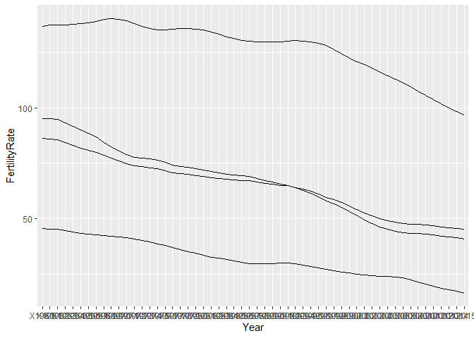
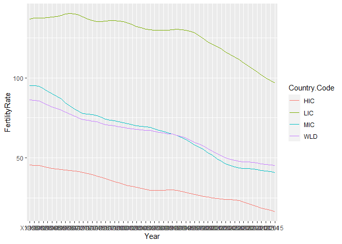
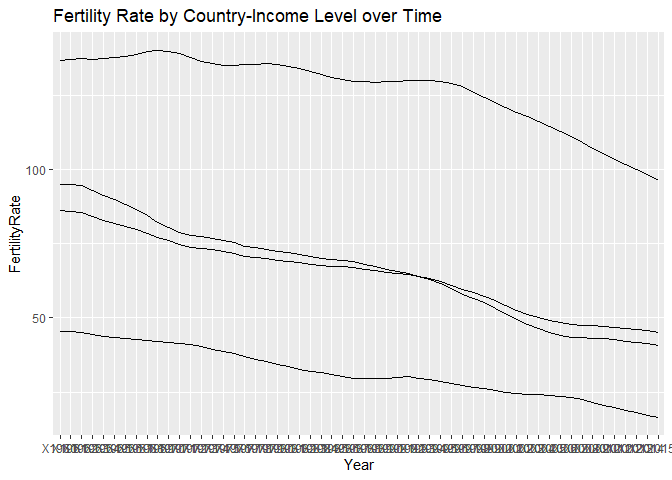
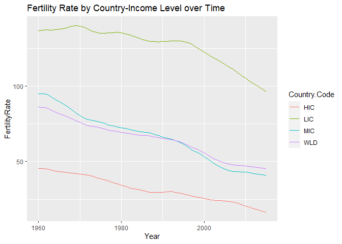

Module 3: Home Work
================
Lemi Daba
10/14/2020

Preamble
--------

In this problem set we will guide you through different ways of
accessing real data sets and how to summarize and describe it properly.
First we will go through some of the data that is collected by the World
Bank. We will do some cleaning on the data before we start analyzing it.
Then, we will try to do a simple web scraping exercise where we will
analyze the data as well.

Let’s start with this dataset from the World Bank. Please download and
save this file in a folder where you can get it easily.

This dataset is a truncated version of one you can find on the [World
Bank Gender Statistics
website](https://datacatalog.worldbank.org/dataset/gender-statistics).
You may visit the website and explore other datasets they offer.
**However, for the purposes of this assignment, please use the file in
this set of instructions**, since the dataset on the World Bank website
may have been updated in the time since this problem set and answer key
was posted.

**NOTE**: It is important to work in the same directory that the files
are or to use the whole path when you specify opening a data set. To
know which directory you are currently working in, you can use the
command `getwd()`. Similarly, in order to set a different directory, you
can use the command `setwd()`.

For the purpose of analyzing the data, we are going to use the packages
**utils** and **tidyverse**. Once you have uploaded the data to R you
are going to see there are multiple indicators of gender, countries and
years in the data. In this case we are just interested in analyzing the
data for one indicator that is the *Adolescent Fertility Rate*, in the
data the indicator code for this variable is called SP.ADO.TFRT . This
indicator measures the annual number of births to women 15 to 19 years
of age per 1,000 women in that age group. It represents the risk of
childbearing among adolescent women 15 to 19 years of age. It is also
referred to as the age-specific fertility rate for women aged 15-19.
Once you have completed this problem set you’ll have more information of
how this rate has evolved over time and how it varies across different
groups of countries.

Take a look at the following lines of code, whose main purpose is to
upload the data in a data frame and to choose the proper indicator.
Please, try to understand the code and then run it in your computer.
Remember to set the directory accordingly to the folder where you saved
the files.

    #Preliminaries
    rm(list=ls())
    library("utils")
    library("tidyverse")

    setwd("-----------")

    #Getting the data
    gender_data <- as_tibble(read.csv("Gender_StatsData.csv"))

**Using the code, answer the following questions:**

Question 1
----------

What is the purpose of the line `rm(list = ls())`?

### Answer

This command removes all current objects in the Global Environment. It
is usually useful when we want to start a new analysis with a clean
slate.

Question 2
----------

The first thing you want to figure out when you look at a new dataset is
how it is organized. If your dataset is stored as a tibble, you can
simply print the object and it will print in a nice-looking format.

Alternatively, you can also use the built-in R commands such as `str()`,
which allows you to see the structure of an object in R. Likewise, the
commands `head()` and `tail()` will allow you to see the first six and
last six observations of your data frame respectively. Another useful
function is the function `dim()`, which will give you the number of rows
and columns in your dataset. Take the time to explore the data using
these commands and others.

Which of the following statements best describes how your data is
organized? Note that we use “indicator” to mean something that is being
measured (e.g. fertility rate, enrollment rate, etc.).

### Answer

``` r
library(tidyverse)
library(utils)

gender_data <- read_csv("Gender_StatsData.csv")
```

With tibbles we can view the first few observations without using
`head()`:

``` r
gender_data
```

    ## # A tibble: 7,101 x 64
    ##       X1 Country.Name Country.Code Indicator.Name Indicator.Code X1960 X1961
    ##    <dbl> <chr>        <chr>        <chr>          <chr>          <dbl> <dbl>
    ##  1     1 Arab World   ARB          Adolescent fe~ SP.ADO.TFRT    134.  135. 
    ##  2     2 Arab World   ARB          Age at first ~ SP.DYN.SMAM.FE  NA    NA  
    ##  3     3 Arab World   ARB          Age at first ~ SP.DYN.SMAM.MA  NA    NA  
    ##  4     4 Arab World   ARB          Age dependenc~ SP.POP.DPND     88.2  89.6
    ##  5     5 Arab World   ARB          Age populatio~ SP.POP.AG00.F~  NA    NA  
    ##  6     6 Arab World   ARB          Age populatio~ SP.POP.AG00.M~  NA    NA  
    ##  7     7 Arab World   ARB          Age populatio~ SP.POP.AG01.F~  NA    NA  
    ##  8     8 Arab World   ARB          Age populatio~ SP.POP.AG02.F~  NA    NA  
    ##  9     9 Arab World   ARB          Age populatio~ SP.POP.AG02.M~  NA    NA  
    ## 10    10 Arab World   ARB          Age populatio~ SP.POP.AG03.F~  NA    NA  
    ## # ... with 7,091 more rows, and 57 more variables: X1962 <dbl>, X1963 <dbl>,
    ## #   X1964 <dbl>, X1965 <dbl>, X1966 <dbl>, X1967 <dbl>, X1968 <dbl>,
    ## #   X1969 <dbl>, X1970 <dbl>, X1971 <dbl>, X1972 <dbl>, X1973 <dbl>,
    ## #   X1974 <dbl>, X1975 <dbl>, X1976 <dbl>, X1977 <dbl>, X1978 <dbl>,
    ## #   X1979 <dbl>, X1980 <dbl>, X1981 <dbl>, X1982 <dbl>, X1983 <dbl>,
    ## #   X1984 <dbl>, X1985 <dbl>, X1986 <dbl>, X1987 <dbl>, X1988 <dbl>,
    ## #   X1989 <dbl>, X1990 <dbl>, X1991 <dbl>, X1992 <dbl>, X1993 <dbl>,
    ## #   X1994 <dbl>, X1995 <dbl>, X1996 <dbl>, X1997 <dbl>, X1998 <dbl>,
    ## #   X1999 <dbl>, X2000 <dbl>, X2001 <dbl>, X2002 <dbl>, X2003 <dbl>,
    ## #   X2004 <dbl>, X2005 <dbl>, X2006 <dbl>, X2007 <dbl>, X2008 <dbl>,
    ## #   X2009 <dbl>, X2010 <dbl>, X2011 <dbl>, X2012 <dbl>, X2013 <dbl>,
    ## #   X2014 <dbl>, X2015 <dbl>, X2016 <dbl>, X2017 <dbl>, X <lgl>

(We can get a more exteded view with `View(gender_data)` in RStudio.)
Here, let’s use knitr’s `kable` command to get a nice formatted tabular
view of the first 15 observations in our data.

``` r
knitr::kable(gender_data[1:15, ])
```

|  X1 | Country.Name | Country.Code | Indicator.Name                                                | Indicator.Code    |     X1960 |     X1961 |    X1962 |     X1963 |     X1964 |     X1965 |     X1966 |     X1967 |     X1968 |     X1969 |    X1970 |     X1971 |     X1972 |     X1973 |     X1974 |     X1975 |     X1976 |     X1977 |     X1978 |     X1979 |    X1980 |    X1981 |    X1982 |    X1983 |    X1984 |    X1985 |    X1986 |    X1987 |    X1988 |    X1989 |    X1990 |    X1991 |    X1992 |    X1993 |    X1994 |    X1995 |    X1996 |    X1997 |    X1998 |    X1999 |    X2000 |    X2001 |    X2002 |   X2003 |    X2004 |    X2005 |    X2006 |    X2007 |    X2008 |    X2009 |    X2010 |    X2011 |    X2012 |    X2013 |    X2014 |    X2015 |    X2016 |    X2017 | X   |
|----:|:-------------|:-------------|:--------------------------------------------------------------|:------------------|----------:|----------:|---------:|----------:|----------:|----------:|----------:|----------:|----------:|----------:|---------:|----------:|----------:|----------:|----------:|----------:|----------:|----------:|----------:|----------:|---------:|---------:|---------:|---------:|---------:|---------:|---------:|---------:|---------:|---------:|---------:|---------:|---------:|---------:|---------:|---------:|---------:|---------:|---------:|---------:|---------:|---------:|---------:|--------:|---------:|---------:|---------:|---------:|---------:|---------:|---------:|---------:|---------:|---------:|---------:|---------:|---------:|---------:|:----|
|   1 | Arab World   | ARB          | Adolescent fertility rate (births per 1,000 women ages 15-19) | SP.ADO.TFRT       | 134.22361 | 134.83863 | 135.5709 | 135.44464 | 135.27490 | 134.94717 | 134.23360 | 133.36223 | 130.87250 | 128.41216 | 126.0751 | 123.83898 | 121.76496 | 119.62902 | 117.47265 | 115.23584 | 112.91609 | 110.52381 | 106.66121 | 102.85523 | 99.13658 | 95.51899 | 91.96122 | 88.18633 | 84.39776 | 80.58370 | 76.71829 | 72.84313 | 71.56606 | 70.32371 | 69.46716 | 68.21199 | 67.31459 | 65.25606 | 63.17755 | 60.90790 | 58.76574 | 56.59019 | 55.74007 | 54.93289 | 54.16982 | 53.31340 | 52.48572 | 52.0346 | 51.62959 | 51.26730 | 50.87727 | 50.54339 | 50.31699 | 50.10461 | 49.90012 | 49.72376 | 49.53907 | 49.11124 | 48.64754 | 48.11455 | 47.44007 |       NA | NA  |
|   2 | Arab World   | ARB          | Age at first marriage, female                                 | SP.DYN.SMAM.FE    |        NA |        NA |       NA |        NA |        NA |        NA |        NA |        NA |        NA |        NA |       NA |        NA |        NA |        NA |        NA |        NA |        NA |        NA |        NA |        NA |       NA |       NA |       NA |       NA |       NA |       NA |       NA |       NA |       NA |       NA |       NA |       NA |       NA |       NA |       NA |       NA |       NA |       NA |       NA |       NA |       NA |       NA |       NA |      NA |       NA |       NA |       NA |       NA |       NA |       NA |       NA |       NA |       NA |       NA |       NA |       NA |       NA |       NA | NA  |
|   3 | Arab World   | ARB          | Age at first marriage, male                                   | SP.DYN.SMAM.MA    |        NA |        NA |       NA |        NA |        NA |        NA |        NA |        NA |        NA |        NA |       NA |        NA |        NA |        NA |        NA |        NA |        NA |        NA |        NA |        NA |       NA |       NA |       NA |       NA |       NA |       NA |       NA |       NA |       NA |       NA |       NA |       NA |       NA |       NA |       NA |       NA |       NA |       NA |       NA |       NA |       NA |       NA |       NA |      NA |       NA |       NA |       NA |       NA |       NA |       NA |       NA |       NA |       NA |       NA |       NA |       NA |       NA |       NA | NA  |
|   4 | Arab World   | ARB          | Age dependency ratio (% of working-age population)            | SP.POP.DPND       |  88.20581 |  89.64473 |  90.9445 |  92.06363 |  92.89288 |  93.36446 |  94.24178 |  94.63345 |  94.68551 |  94.56361 |  94.3360 |  94.59772 |  94.61873 |  94.45822 |  94.18243 |  93.85107 |  93.68274 |  93.43655 |  93.11851 |  92.70133 | 92.16788 | 91.88224 | 91.43619 | 90.87598 | 90.26319 | 89.62859 | 89.37816 | 89.02484 | 88.58989 | 88.04431 | 87.48134 | 86.72618 | 86.05812 | 84.90675 | 83.59814 | 81.94642 | 80.57681 | 79.14266 | 77.67581 | 76.19787 | 74.71481 | 73.21952 | 71.74723 | 70.3091 | 68.92062 | 67.60288 | 66.41868 | 65.27545 | 64.23529 | 63.36503 | 62.69472 | 62.34170 | 62.16885 | 62.11819 | 62.08986 | 62.01723 | 62.05748 | 61.91618 | NA  |
|   5 | Arab World   | ARB          | Age population, age 0, female, interpolated                   | SP.POP.AG00.FE.IN |        NA |        NA |       NA |        NA |        NA |        NA |        NA |        NA |        NA |        NA |       NA |        NA |        NA |        NA |        NA |        NA |        NA |        NA |        NA |        NA |       NA |       NA |       NA |       NA |       NA |       NA |       NA |       NA |       NA |       NA |       NA |       NA |       NA |       NA |       NA |       NA |       NA |       NA |       NA |       NA |       NA |       NA |       NA |      NA |       NA |       NA |       NA |       NA |       NA |       NA |       NA |       NA |       NA |       NA |       NA |       NA |       NA |       NA | NA  |
|   6 | Arab World   | ARB          | Age population, age 0, male, interpolated                     | SP.POP.AG00.MA.IN |        NA |        NA |       NA |        NA |        NA |        NA |        NA |        NA |        NA |        NA |       NA |        NA |        NA |        NA |        NA |        NA |        NA |        NA |        NA |        NA |       NA |       NA |       NA |       NA |       NA |       NA |       NA |       NA |       NA |       NA |       NA |       NA |       NA |       NA |       NA |       NA |       NA |       NA |       NA |       NA |       NA |       NA |       NA |      NA |       NA |       NA |       NA |       NA |       NA |       NA |       NA |       NA |       NA |       NA |       NA |       NA |       NA |       NA | NA  |
|   7 | Arab World   | ARB          | Age population, age 01, female, interpolated                  | SP.POP.AG01.FE.IN |        NA |        NA |       NA |        NA |        NA |        NA |        NA |        NA |        NA |        NA |       NA |        NA |        NA |        NA |        NA |        NA |        NA |        NA |        NA |        NA |       NA |       NA |       NA |       NA |       NA |       NA |       NA |       NA |       NA |       NA |       NA |       NA |       NA |       NA |       NA |       NA |       NA |       NA |       NA |       NA |       NA |       NA |       NA |      NA |       NA |       NA |       NA |       NA |       NA |       NA |       NA |       NA |       NA |       NA |       NA |       NA |       NA |       NA | NA  |
|   8 | Arab World   | ARB          | Age population, age 02, female, interpolated                  | SP.POP.AG02.FE.IN |        NA |        NA |       NA |        NA |        NA |        NA |        NA |        NA |        NA |        NA |       NA |        NA |        NA |        NA |        NA |        NA |        NA |        NA |        NA |        NA |       NA |       NA |       NA |       NA |       NA |       NA |       NA |       NA |       NA |       NA |       NA |       NA |       NA |       NA |       NA |       NA |       NA |       NA |       NA |       NA |       NA |       NA |       NA |      NA |       NA |       NA |       NA |       NA |       NA |       NA |       NA |       NA |       NA |       NA |       NA |       NA |       NA |       NA | NA  |
|   9 | Arab World   | ARB          | Age population, age 02, male, interpolated                    | SP.POP.AG02.MA.IN |        NA |        NA |       NA |        NA |        NA |        NA |        NA |        NA |        NA |        NA |       NA |        NA |        NA |        NA |        NA |        NA |        NA |        NA |        NA |        NA |       NA |       NA |       NA |       NA |       NA |       NA |       NA |       NA |       NA |       NA |       NA |       NA |       NA |       NA |       NA |       NA |       NA |       NA |       NA |       NA |       NA |       NA |       NA |      NA |       NA |       NA |       NA |       NA |       NA |       NA |       NA |       NA |       NA |       NA |       NA |       NA |       NA |       NA | NA  |
|  10 | Arab World   | ARB          | Age population, age 03, female, interpolated                  | SP.POP.AG03.FE.IN |        NA |        NA |       NA |        NA |        NA |        NA |        NA |        NA |        NA |        NA |       NA |        NA |        NA |        NA |        NA |        NA |        NA |        NA |        NA |        NA |       NA |       NA |       NA |       NA |       NA |       NA |       NA |       NA |       NA |       NA |       NA |       NA |       NA |       NA |       NA |       NA |       NA |       NA |       NA |       NA |       NA |       NA |       NA |      NA |       NA |       NA |       NA |       NA |       NA |       NA |       NA |       NA |       NA |       NA |       NA |       NA |       NA |       NA | NA  |
|  11 | Arab World   | ARB          | Age population, age 03, male, interpolated                    | SP.POP.AG03.MA.IN |        NA |        NA |       NA |        NA |        NA |        NA |        NA |        NA |        NA |        NA |       NA |        NA |        NA |        NA |        NA |        NA |        NA |        NA |        NA |        NA |       NA |       NA |       NA |       NA |       NA |       NA |       NA |       NA |       NA |       NA |       NA |       NA |       NA |       NA |       NA |       NA |       NA |       NA |       NA |       NA |       NA |       NA |       NA |      NA |       NA |       NA |       NA |       NA |       NA |       NA |       NA |       NA |       NA |       NA |       NA |       NA |       NA |       NA | NA  |
|  12 | Arab World   | ARB          | Age population, age 04, female, interpolated                  | SP.POP.AG04.FE.IN |        NA |        NA |       NA |        NA |        NA |        NA |        NA |        NA |        NA |        NA |       NA |        NA |        NA |        NA |        NA |        NA |        NA |        NA |        NA |        NA |       NA |       NA |       NA |       NA |       NA |       NA |       NA |       NA |       NA |       NA |       NA |       NA |       NA |       NA |       NA |       NA |       NA |       NA |       NA |       NA |       NA |       NA |       NA |      NA |       NA |       NA |       NA |       NA |       NA |       NA |       NA |       NA |       NA |       NA |       NA |       NA |       NA |       NA | NA  |
|  13 | Arab World   | ARB          | Age population, age 04, male, interpolated                    | SP.POP.AG04.MA.IN |        NA |        NA |       NA |        NA |        NA |        NA |        NA |        NA |        NA |        NA |       NA |        NA |        NA |        NA |        NA |        NA |        NA |        NA |        NA |        NA |       NA |       NA |       NA |       NA |       NA |       NA |       NA |       NA |       NA |       NA |       NA |       NA |       NA |       NA |       NA |       NA |       NA |       NA |       NA |       NA |       NA |       NA |       NA |      NA |       NA |       NA |       NA |       NA |       NA |       NA |       NA |       NA |       NA |       NA |       NA |       NA |       NA |       NA | NA  |
|  14 | Arab World   | ARB          | Age population, age 05, female, interpolated                  | SP.POP.AG05.FE.IN |        NA |        NA |       NA |        NA |        NA |        NA |        NA |        NA |        NA |        NA |       NA |        NA |        NA |        NA |        NA |        NA |        NA |        NA |        NA |        NA |       NA |       NA |       NA |       NA |       NA |       NA |       NA |       NA |       NA |       NA |       NA |       NA |       NA |       NA |       NA |       NA |       NA |       NA |       NA |       NA |       NA |       NA |       NA |      NA |       NA |       NA |       NA |       NA |       NA |       NA |       NA |       NA |       NA |       NA |       NA |       NA |       NA |       NA | NA  |
|  15 | Arab World   | ARB          | Age population, age 05, male, interpolated                    | SP.POP.AG05.MA.IN |        NA |        NA |       NA |        NA |        NA |        NA |        NA |        NA |        NA |        NA |       NA |        NA |        NA |        NA |        NA |        NA |        NA |        NA |        NA |        NA |       NA |       NA |       NA |       NA |       NA |       NA |       NA |       NA |       NA |       NA |       NA |       NA |       NA |       NA |       NA |       NA |       NA |       NA |       NA |       NA |       NA |       NA |       NA |      NA |       NA |       NA |       NA |       NA |       NA |       NA |       NA |       NA |       NA |       NA |       NA |       NA |       NA |       NA | NA  |

It seems each observation corresponds to a country-indicator
combination. To confirm our suspicion, let’s count the observations in
each country-indicator combination and see if any of them contain more
than one observation:

``` r
gender_data %>%
  count(Country.Code, Indicator.Code) %>%
  filter(n > 1)
```

    ## # A tibble: 0 x 3
    ## # ... with 3 variables: Country.Code <chr>, Indicator.Code <chr>, n <int>

There are 0 groups with more than 1 observation in them. So the
variables `Country.Code` and `Indicator.Code` do indeed uniquely
identify each observation.

Question 3
----------

Now, generate a tibble called “`teenager_fr`”, which contains only the
adolescent fertility rate indicator for each country-year. Please fill
in the blank with the correct code.

### Answer

``` r
teenager_fr <- filter(
  gender_data,
  Indicator.Code == "SP.ADO.TFRT"
)

teenager_fr
```

    ## # A tibble: 263 x 64
    ##       X1 Country.Name Country.Code Indicator.Name Indicator.Code X1960 X1961
    ##    <dbl> <chr>        <chr>        <chr>          <chr>          <dbl> <dbl>
    ##  1     1 Arab World   ARB          Adolescent fe~ SP.ADO.TFRT    134.  135. 
    ##  2    28 Caribbean s~ CSS          Adolescent fe~ SP.ADO.TFRT    147.  147. 
    ##  3    55 Central Eur~ CEB          Adolescent fe~ SP.ADO.TFRT     46.1  45.4
    ##  4    82 Early-demog~ EAR          Adolescent fe~ SP.ADO.TFRT    116.  117. 
    ##  5   109 East Asia &~ EAS          Adolescent fe~ SP.ADO.TFRT     65.9  65.0
    ##  6   136 East Asia &~ EAP          Adolescent fe~ SP.ADO.TFRT     75.2  74.5
    ##  7   163 East Asia &~ TEA          Adolescent fe~ SP.ADO.TFRT     76.6  75.9
    ##  8   190 Euro area    EMU          Adolescent fe~ SP.ADO.TFRT     27.1  28.2
    ##  9   217 Europe & Ce~ ECS          Adolescent fe~ SP.ADO.TFRT     41.2  41.9
    ## 10   244 Europe & Ce~ ECA          Adolescent fe~ SP.ADO.TFRT     47.3  47.8
    ## # ... with 253 more rows, and 57 more variables: X1962 <dbl>, X1963 <dbl>,
    ## #   X1964 <dbl>, X1965 <dbl>, X1966 <dbl>, X1967 <dbl>, X1968 <dbl>,
    ## #   X1969 <dbl>, X1970 <dbl>, X1971 <dbl>, X1972 <dbl>, X1973 <dbl>,
    ## #   X1974 <dbl>, X1975 <dbl>, X1976 <dbl>, X1977 <dbl>, X1978 <dbl>,
    ## #   X1979 <dbl>, X1980 <dbl>, X1981 <dbl>, X1982 <dbl>, X1983 <dbl>,
    ## #   X1984 <dbl>, X1985 <dbl>, X1986 <dbl>, X1987 <dbl>, X1988 <dbl>,
    ## #   X1989 <dbl>, X1990 <dbl>, X1991 <dbl>, X1992 <dbl>, X1993 <dbl>,
    ## #   X1994 <dbl>, X1995 <dbl>, X1996 <dbl>, X1997 <dbl>, X1998 <dbl>,
    ## #   X1999 <dbl>, X2000 <dbl>, X2001 <dbl>, X2002 <dbl>, X2003 <dbl>,
    ## #   X2004 <dbl>, X2005 <dbl>, X2006 <dbl>, X2007 <dbl>, X2008 <dbl>,
    ## #   X2009 <dbl>, X2010 <dbl>, X2011 <dbl>, X2012 <dbl>, X2013 <dbl>,
    ## #   X2014 <dbl>, X2015 <dbl>, X2016 <dbl>, X2017 <dbl>, X <lgl>

Question 3 (continued)
----------------------

What is the equivalent base-R function ? (select one)

(Choices are not shown here.)

### Answer

Out of the three alternatives presented, `subset()` is the equivalent
base-R function to dplyr’s `filter()`. The following code gives the same
result as using `filter()` above.

``` r
subset(gender_data, Indicator.Code == "SP.ADO.TFRT")
```

    ## # A tibble: 263 x 64
    ##       X1 Country.Name Country.Code Indicator.Name Indicator.Code X1960 X1961
    ##    <dbl> <chr>        <chr>        <chr>          <chr>          <dbl> <dbl>
    ##  1     1 Arab World   ARB          Adolescent fe~ SP.ADO.TFRT    134.  135. 
    ##  2    28 Caribbean s~ CSS          Adolescent fe~ SP.ADO.TFRT    147.  147. 
    ##  3    55 Central Eur~ CEB          Adolescent fe~ SP.ADO.TFRT     46.1  45.4
    ##  4    82 Early-demog~ EAR          Adolescent fe~ SP.ADO.TFRT    116.  117. 
    ##  5   109 East Asia &~ EAS          Adolescent fe~ SP.ADO.TFRT     65.9  65.0
    ##  6   136 East Asia &~ EAP          Adolescent fe~ SP.ADO.TFRT     75.2  74.5
    ##  7   163 East Asia &~ TEA          Adolescent fe~ SP.ADO.TFRT     76.6  75.9
    ##  8   190 Euro area    EMU          Adolescent fe~ SP.ADO.TFRT     27.1  28.2
    ##  9   217 Europe & Ce~ ECS          Adolescent fe~ SP.ADO.TFRT     41.2  41.9
    ## 10   244 Europe & Ce~ ECA          Adolescent fe~ SP.ADO.TFRT     47.3  47.8
    ## # ... with 253 more rows, and 57 more variables: X1962 <dbl>, X1963 <dbl>,
    ## #   X1964 <dbl>, X1965 <dbl>, X1966 <dbl>, X1967 <dbl>, X1968 <dbl>,
    ## #   X1969 <dbl>, X1970 <dbl>, X1971 <dbl>, X1972 <dbl>, X1973 <dbl>,
    ## #   X1974 <dbl>, X1975 <dbl>, X1976 <dbl>, X1977 <dbl>, X1978 <dbl>,
    ## #   X1979 <dbl>, X1980 <dbl>, X1981 <dbl>, X1982 <dbl>, X1983 <dbl>,
    ## #   X1984 <dbl>, X1985 <dbl>, X1986 <dbl>, X1987 <dbl>, X1988 <dbl>,
    ## #   X1989 <dbl>, X1990 <dbl>, X1991 <dbl>, X1992 <dbl>, X1993 <dbl>,
    ## #   X1994 <dbl>, X1995 <dbl>, X1996 <dbl>, X1997 <dbl>, X1998 <dbl>,
    ## #   X1999 <dbl>, X2000 <dbl>, X2001 <dbl>, X2002 <dbl>, X2003 <dbl>,
    ## #   X2004 <dbl>, X2005 <dbl>, X2006 <dbl>, X2007 <dbl>, X2008 <dbl>,
    ## #   X2009 <dbl>, X2010 <dbl>, X2011 <dbl>, X2012 <dbl>, X2013 <dbl>,
    ## #   X2014 <dbl>, X2015 <dbl>, X2016 <dbl>, X2017 <dbl>, X <lgl>

`which()` returns the position of the elements (i.e., row number/column
number/array index) in a logical vector which are TRUE, whereas
`match()` returns the position of first occurrence of its first argument
in its second.

Question 4
----------

Since we are not interested in any other variables and the gender\_data
dataset is quite large, you might want to get rid of it instead of
asking R to keep it stored in memory.

Which of the following is the correct code for getting rid of the object
`gender_data`?

(Choices are not displayed here.)

### Answer

Use `rm()` to remove objects from the global environment. So
`rm(gender_data)` achieves the desired result.

Part 1: Questions 5-8
---------------------

Now that you have loaded the data we want to analyze and have
familiarized yourself with the structure, it is time to get our hands
dirty!

A second exploratory thing to do once we have organized a data set is to
get basic summary statistics of the data. Now let’s do this! To print
summary statistics directly in your console, you can use any of the
basic summary functions in R (`mean()`, `sd()`, `min()`, `max()`,
`sum()` …). The basic summary functions take vectors as an input, and
output a single value.

For example, if you were interested in obtaining the sample mean of the
Adolescent Fertility Rate in 1975, one way of doing this is as follows:

    mean(teenager_fr$X1975, na.rm = TRUE)

Question 5
----------

Why it is necessary to add the option `na.rm = TRUE` to the above
command? (Select all that apply)

(Choice are not shown here.)

### Answer

The `na.rm` argument removes missing (`NA`) values while applying the
function to compute summary statistics. In R, the default value for this
argument is `FALSE` which means R does not remove missing values when
applying the function. This was done for safety reasons because missing
values are important and it’s a bad idea to silently ignore missing
values by default (See Wickham and Grolemund (2017)). The downside is
that if there is even a single missing value in our data, the function
returns `NA`, because any computation with missing values produces a
missing value.

------------------------------------------------------------------------

To calculate summary statistics for a group of variables, there are a
few different commands. The command `mean()` is just one example of the
different options available. Now, we ask you to go through the R
documentation and explore some of the other commands by yourself.

If you want to store the output as values in your dataset, or if you
want to do something more complicated (ex. Generate these by group, or
use one of the dplyr summary functions (ex. `n_distinct()`), you can use
any of the basic summary functions as well as others, in combination
with `mutate()` and `summarise()` to generate variables in your dataset
containing summary values.

Now that you’ve learned how to look at and generate summary statistics,
answer the following questions.

------------------------------------------------------------------------

Question 6
----------

What is the sample mean and standard deviation of the adolescent
fertility rate in 1960?

*Please round your answers to the second hundredth decimal place,
i.e. if your answer is 2.356, round it to 2.36.*

### Answer

``` r
mean_fr_1960 <- mean(teenager_fr$X1960, na.rm = TRUE) %>% round(2)
cat("Sample mean of FR in 1960: ", mean_fr_1960)
```

    ## Sample mean of FR in 1960:  101.33

``` r
sd_fr_1960 <- sd(teenager_fr$X1960, na.rm = TRUE) %>% round(2)
cat("Standard deviation of FR in 1960: ", sd_fr_1960)
```

    ## Standard deviation of FR in 1960:  54.21

Question 7
----------

What is the sample mean and standard deviation of the adolescent
fertility rate in 2000?

*Please round your answers to the second hundredth decimal place,
i.e. if you answer is 2.356 round it 2.36.*

### Answer

``` r
mean_fr_2000 <- mean(teenager_fr$X2000, na.rm = TRUE) %>% round(2)
cat("Sample mean of FR in 2000: ", mean_fr_2000)
```

    ## Sample mean of FR in 2000:  63.15

``` r
sd_fr_2000 <- sd(teenager_fr$X2000, na.rm = TRUE) %>% round(2)
cat("Standard deviation of FR in 2000: ", sd_fr_2000)
```

    ## Standard deviation of FR in 2000:  46.92

Question 8
----------

True or False? Based on the results from Questions 6 and 7, we can
conclude that the Adolescent Fertility Rate has had a permanent
decreasing (i.e. only decreases and never increases during this period)
trend from 1960-2000, and that the dispersion of this variable has
decreased over time.

### Answer

Based on the observations at the two points in time (1960 and 2000)
alone, we cannot conclude that there was a decreasing or an increasing
trend. So the answer is false.

------------------------------------------------------------------------

Now, we are interested in plotting the evolution of the Adolescent
Fertility Rate from 1960 to 2015. In addition, we are interested in
having different information in the same plot. First, we want to plot
the sample mean of all the data set, but also we want to add more
information such as the rate for low, middle and high income countries
(an indicator for country code is stored in the variable
“`Country.Code`”).

Inspect this variable to get a sense of what it contains. Note that it
includes indicators for both countries, regions, and income group. Since
we are only interested in the trends by income group, we want to filter
the data to contain only the fertility rate for high, middle, and low
income countries as well as the world average.

------------------------------------------------------------------------

Question 9
----------

Use the dplyr `filter()` command and the logical `%in%` to keep only the
relevant `Country.Code` observations in `teenager_fr.` Make sure you
name the new dataset “`byincomelevel`”. Choose the line of code below:

(Choices are not shown here.)

### Answer

(Based on the choices provided.)

``` r
byincomelevel <- filter(teenager_fr, Country.Code %in% c("LIC", "MIC", "HIC", "WLD") )

byincomelevel
```

    ## # A tibble: 4 x 64
    ##      X1 Country.Name Country.Code Indicator.Name Indicator.Code X1960 X1961
    ##   <dbl> <chr>        <chr>        <chr>          <chr>          <dbl> <dbl>
    ## 1   379 High income  HIC          Adolescent fe~ SP.ADO.TFRT     45.5  45.3
    ## 2   703 Low income   LIC          Adolescent fe~ SP.ADO.TFRT    137.  137. 
    ## 3   838 Middle inco~ MIC          Adolescent fe~ SP.ADO.TFRT     95.0  95.1
    ## 4  1216 World        WLD          Adolescent fe~ SP.ADO.TFRT     86.2  86.0
    ## # ... with 57 more variables: X1962 <dbl>, X1963 <dbl>, X1964 <dbl>,
    ## #   X1965 <dbl>, X1966 <dbl>, X1967 <dbl>, X1968 <dbl>, X1969 <dbl>,
    ## #   X1970 <dbl>, X1971 <dbl>, X1972 <dbl>, X1973 <dbl>, X1974 <dbl>,
    ## #   X1975 <dbl>, X1976 <dbl>, X1977 <dbl>, X1978 <dbl>, X1979 <dbl>,
    ## #   X1980 <dbl>, X1981 <dbl>, X1982 <dbl>, X1983 <dbl>, X1984 <dbl>,
    ## #   X1985 <dbl>, X1986 <dbl>, X1987 <dbl>, X1988 <dbl>, X1989 <dbl>,
    ## #   X1990 <dbl>, X1991 <dbl>, X1992 <dbl>, X1993 <dbl>, X1994 <dbl>,
    ## #   X1995 <dbl>, X1996 <dbl>, X1997 <dbl>, X1998 <dbl>, X1999 <dbl>,
    ## #   X2000 <dbl>, X2001 <dbl>, X2002 <dbl>, X2003 <dbl>, X2004 <dbl>,
    ## #   X2005 <dbl>, X2006 <dbl>, X2007 <dbl>, X2008 <dbl>, X2009 <dbl>,
    ## #   X2010 <dbl>, X2011 <dbl>, X2012 <dbl>, X2013 <dbl>, X2014 <dbl>,
    ## #   X2015 <dbl>, X2016 <dbl>, X2017 <dbl>, X <lgl>

------------------------------------------------------------------------

Notice, there are still two problems with the resulting data:

1.  It contains additional variables that we don’t need or are
    meaningless at this level of aggregation.

2.  It is not organized in a very intuitive way. A more natural way to
    organize this data, and prepare it for plotting, is to have each
    observation represent either a year or a country group-year, and
    each of the columns represent either the fertility rate for a given
    group, or if the data is at the country-group year level, then just
    the fertility rate.

------------------------------------------------------------------------

Question 10
-----------

Suppose you decide you prefer to have one observation per income group
and year. The tidyr command `gather()` can help you achieve this. Look
up the command in the help files. Select the set of arguments that
belong in the blanks below.

### Answer

(Based on the code given in the question.)

``` r
plotdata_bygroupyear <- gather(byincomelevel, Year, FertilityRate, X1960:X2015) %>%
  select(Year, Country.Name, Country.Code, FertilityRate)

plotdata_bygroupyear
```

    ## # A tibble: 224 x 4
    ##    Year  Country.Name  Country.Code FertilityRate
    ##    <chr> <chr>         <chr>                <dbl>
    ##  1 X1960 High income   HIC                   45.5
    ##  2 X1960 Low income    LIC                  137. 
    ##  3 X1960 Middle income MIC                   95.0
    ##  4 X1960 World         WLD                   86.2
    ##  5 X1961 High income   HIC                   45.3
    ##  6 X1961 Low income    LIC                  137. 
    ##  7 X1961 Middle income MIC                   95.1
    ##  8 X1961 World         WLD                   86.0
    ##  9 X1962 High income   HIC                   45.1
    ## 10 X1962 Low income    LIC                  138. 
    ## # ... with 214 more rows

An alternative and more recent approach to do this is using the tidyr
`pivot_longer()` function.

``` r
byincomelevel %>% 
  pivot_longer(X1960:X2015, names_to = "Year", values_to = "FertilityRate") %>%
  select(Year, Country.Name, Country.Code, FertilityRate) %>% 
  arrange(Year)
```

    ## # A tibble: 224 x 4
    ##    Year  Country.Name  Country.Code FertilityRate
    ##    <chr> <chr>         <chr>                <dbl>
    ##  1 X1960 High income   HIC                   45.5
    ##  2 X1960 Low income    LIC                  137. 
    ##  3 X1960 Middle income MIC                   95.0
    ##  4 X1960 World         WLD                   86.2
    ##  5 X1961 High income   HIC                   45.3
    ##  6 X1961 Low income    LIC                  137. 
    ##  7 X1961 Middle income MIC                   95.1
    ##  8 X1961 World         WLD                   86.0
    ##  9 X1962 High income   HIC                   45.1
    ## 10 X1962 Low income    LIC                  138. 
    ## # ... with 214 more rows

Question 11
-----------

Suppose you take a look at the data and change your mind. You decided
you prefer to look at the data at the year level and have the fertility
rates for each income-group as separate variables. The tidyr command
`spread()` can help you achieve this. Look up the command in the help
files. Select the set of arguments that belong in the blanks below:

(The incomplete code is not shown here.)

### Answer

``` r
plotdata_byyear <- select(plotdata_bygroupyear, Country.Code, Year, FertilityRate) %>% 
  spread(Country.Code, FertilityRate)

plotdata_byyear
```

    ## # A tibble: 56 x 5
    ##    Year    HIC   LIC   MIC   WLD
    ##    <chr> <dbl> <dbl> <dbl> <dbl>
    ##  1 X1960  45.5  137.  95.0  86.2
    ##  2 X1961  45.3  137.  95.1  86.0
    ##  3 X1962  45.1  138.  94.7  85.5
    ##  4 X1963  44.5  137.  93.1  84.2
    ##  5 X1964  43.9  138.  91.5  82.9
    ##  6 X1965  43.4  138.  89.9  81.8
    ##  7 X1966  42.9  138.  88.3  80.8
    ##  8 X1967  42.6  139.  86.8  79.9
    ##  9 X1968  42.4  140.  84.5  78.6
    ## 10 X1969  42.0  140.  82.4  77.2
    ## # ... with 46 more rows

Again, there is a more recent alternative to achieve the same using
tidyr’s `pivot_wider()`:

``` r
plotdata_bygroupyear %>%
  select(Country.Code, Year, FertilityRate) %>%
  pivot_wider(names_from = Country.Code, values_from = FertilityRate)
```

    ## # A tibble: 56 x 5
    ##    Year    HIC   LIC   MIC   WLD
    ##    <chr> <dbl> <dbl> <dbl> <dbl>
    ##  1 X1960  45.5  137.  95.0  86.2
    ##  2 X1961  45.3  137.  95.1  86.0
    ##  3 X1962  45.1  138.  94.7  85.5
    ##  4 X1963  44.5  137.  93.1  84.2
    ##  5 X1964  43.9  138.  91.5  82.9
    ##  6 X1965  43.4  138.  89.9  81.8
    ##  7 X1966  42.9  138.  88.3  80.8
    ##  8 X1967  42.6  139.  86.8  79.9
    ##  9 X1968  42.4  140.  84.5  78.6
    ## 10 X1969  42.0  140.  82.4  77.2
    ## # ... with 46 more rows

Question 12
-----------

True or False? The select statement in the code for question 11 is
redundant since we already selected the variables we wanted in
generating `plotdata_byyear`.

### Answer

The `select()` function was necessary to exclude `Country.Name`, which
is basically the same with `Country.Code`. If we had skipped the
selection step, we will basically have the same structure with the
original data (`plotdata_bygroupyear`) with new columns from the
variable `Country.Code` and with lots of missing values, which is not
nice to look at. Here is an example:

``` r
plotdata_bygroupyear %>% 
  spread(Country.Code, FertilityRate)
```

    ## # A tibble: 224 x 6
    ##    Year  Country.Name    HIC   LIC   MIC   WLD
    ##    <chr> <chr>         <dbl> <dbl> <dbl> <dbl>
    ##  1 X1960 High income    45.5   NA   NA    NA  
    ##  2 X1960 Low income     NA    137.  NA    NA  
    ##  3 X1960 Middle income  NA     NA   95.0  NA  
    ##  4 X1960 World          NA     NA   NA    86.2
    ##  5 X1961 High income    45.3   NA   NA    NA  
    ##  6 X1961 Low income     NA    137.  NA    NA  
    ##  7 X1961 Middle income  NA     NA   95.1  NA  
    ##  8 X1961 World          NA     NA   NA    86.0
    ##  9 X1962 High income    45.1   NA   NA    NA  
    ## 10 X1962 Low income     NA    138.  NA    NA  
    ## # ... with 214 more rows

So the answer to this question is false.

Question 13
-----------

Good news. We are finally ready to plot the data! Let’s begin by
plotting the fertility rate over time, separately for each income level.
To do this, we can use the basic `ggplot` syntax Prof. Duflo explained
in lecture.

Let’s start by trying to generate this plot using the
`plotdata_bygroupyear` tibble we generated earlier. Here is the code to
generate this plot. Select the set of arguments that belong in the
blanks to generate the desired plot.

(The incomplete code is not shown here.)

### Answer

``` r
ggplot(plotdata_bygroupyear, aes(x = Year, y = FertilityRate, group = Country.Code)) +
  geom_line()
```

<!-- -->

Question 14
-----------

It would be nicer if the different plot lines had different colors. You
can add the argument `color=Country.Code` to the code you generated in
question 13. Where do you need to specify this argument? Select one of
the Roman numeral blanks in the code below, to replace with,
`color=Country.Code` or `color=Country.Code` in order for each of the
lines to have a different color.

Note that the unnumbered blanks are from Question 13.

(The incomplete code and the choices are not shown here.)

### Answer

The color argument must be specified inside aesthetics. So we have

``` r
ggplot(plotdata_bygroupyear, aes(x = Year, y = FertilityRate, group = Country.Code, color = Country.Code)) +
  geom_line()
```

<!-- -->

Question 15
-----------

It is good practice to include titles in your plot. To do this, look up
the ggplot `labs()`. Select one of the Roman numeral blanks in the code
below to replace with (possibly preceded by `,` or `+`)
`labs(title='Fertility Rate by Country-Income-Level over Time')`.

Note that the unnumbered blanks are from Question 13.

(The incomplete code and the choices are not shown here.)

### Answer

Plot labels are added independently with a `+`. (See the “Data
Visualization with ggplot2” cheat sheet). So our code becomes:

``` r
ggplot(plotdata_bygroupyear, aes(x = Year, y = FertilityRate, group = Country.Code)) +
  geom_line() +
  labs(title = "Fertility Rate by Country-Income Level over Time")
```

<!-- -->

Question 16
-----------

One more thing we could improve in this plot is the x-axis labels.
First, we can remove the leading “X”. Second, by storing them as
numeric, `ggplot` can use its “optimal” scaling to make a prettier plot
instead of having a label for each year. To do this, we can transform
the Year variable using `dplyr`’s mutate function and a combination of
the functions `as.numeric()` and the `stringr` package. Try to figure
out a few ways to do this.

Which of the following statements are equivalent and can be used in the
blank below, to complete it? Select all that apply.

(The incomplete code is not shown here.)

### Answer

All three options are possible ways to strip the X’s from the year
column. Let’s show this.

`str_sub()` subsets a character vector based on an index position
specified. (see the help manual). It subsets starting from the last
character when given a negative argument. So `str_sub(Year, -4)`
extracts the last 4 characters for each element of `Year`, which
automatically removes the X’s.

``` r
plotdata_bygroupyear %>% 
  mutate(year = str_sub(Year, -4))
```

    ## # A tibble: 224 x 5
    ##    Year  Country.Name  Country.Code FertilityRate year 
    ##    <chr> <chr>         <chr>                <dbl> <chr>
    ##  1 X1960 High income   HIC                   45.5 1960 
    ##  2 X1960 Low income    LIC                  137.  1960 
    ##  3 X1960 Middle income MIC                   95.0 1960 
    ##  4 X1960 World         WLD                   86.2 1960 
    ##  5 X1961 High income   HIC                   45.3 1961 
    ##  6 X1961 Low income    LIC                  137.  1961 
    ##  7 X1961 Middle income MIC                   95.1 1961 
    ##  8 X1961 World         WLD                   86.0 1961 
    ##  9 X1962 High income   HIC                   45.1 1962 
    ## 10 X1962 Low income    LIC                  138.  1962 
    ## # ... with 214 more rows

`str_sub(Year, 2, 5)` also achieves the same. Here, 2 is the starting
and 5 is the ending index to subset. So this extracts the second, third,
fourth and fifth characters, which means the X’s will be dropped.

``` r
plotdata_bygroupyear %>% 
  mutate(year = str_sub(Year, 2, 5))
```

    ## # A tibble: 224 x 5
    ##    Year  Country.Name  Country.Code FertilityRate year 
    ##    <chr> <chr>         <chr>                <dbl> <chr>
    ##  1 X1960 High income   HIC                   45.5 1960 
    ##  2 X1960 Low income    LIC                  137.  1960 
    ##  3 X1960 Middle income MIC                   95.0 1960 
    ##  4 X1960 World         WLD                   86.2 1960 
    ##  5 X1961 High income   HIC                   45.3 1961 
    ##  6 X1961 Low income    LIC                  137.  1961 
    ##  7 X1961 Middle income MIC                   95.1 1961 
    ##  8 X1961 World         WLD                   86.0 1961 
    ##  9 X1962 High income   HIC                   45.1 1962 
    ## 10 X1962 Low income    LIC                  138.  1962 
    ## # ... with 214 more rows

`str_replace(Year, "X", "")`, on the other hand, replaces an “X” with an
empty character (`""`) when it detects one.

``` r
plotdata_bygroupyear %>% 
  mutate(year = str_replace(Year, "X", ""))
```

    ## # A tibble: 224 x 5
    ##    Year  Country.Name  Country.Code FertilityRate year 
    ##    <chr> <chr>         <chr>                <dbl> <chr>
    ##  1 X1960 High income   HIC                   45.5 1960 
    ##  2 X1960 Low income    LIC                  137.  1960 
    ##  3 X1960 Middle income MIC                   95.0 1960 
    ##  4 X1960 World         WLD                   86.2 1960 
    ##  5 X1961 High income   HIC                   45.3 1961 
    ##  6 X1961 Low income    LIC                  137.  1961 
    ##  7 X1961 Middle income MIC                   95.1 1961 
    ##  8 X1961 World         WLD                   86.0 1961 
    ##  9 X1962 High income   HIC                   45.1 1962 
    ## 10 X1962 Low income    LIC                  138.  1962 
    ## # ... with 214 more rows

But notice that in all three cases, a new *character* column is created.
So we use the `as.numeric()` function to convert it to numeric.

``` r
plotdata_bygroupyear <- mutate(plotdata_bygroupyear, Year = as.numeric(str_replace(Year, "X", "")))

plotdata_bygroupyear
```

    ## # A tibble: 224 x 4
    ##     Year Country.Name  Country.Code FertilityRate
    ##    <dbl> <chr>         <chr>                <dbl>
    ##  1  1960 High income   HIC                   45.5
    ##  2  1960 Low income    LIC                  137. 
    ##  3  1960 Middle income MIC                   95.0
    ##  4  1960 World         WLD                   86.2
    ##  5  1961 High income   HIC                   45.3
    ##  6  1961 Low income    LIC                  137. 
    ##  7  1961 Middle income MIC                   95.1
    ##  8  1961 World         WLD                   86.0
    ##  9  1962 High income   HIC                   45.1
    ## 10  1962 Low income    LIC                  138. 
    ## # ... with 214 more rows

Let’s see if our plot has improved.

``` r
ggplot(plotdata_bygroupyear, aes(x = Year, y = FertilityRate, color = Country.Code)) +
  geom_line() +
  labs(title = "Fertility Rate by Country-Income Level over Time")
```

<!-- -->

That’s better!
