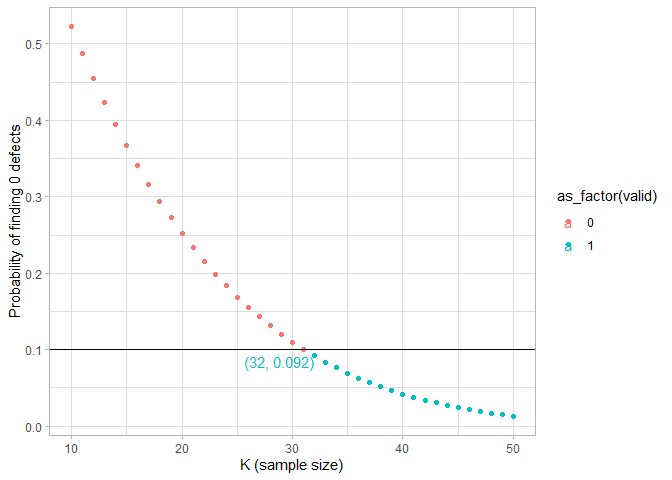

Module 5: Home Work
================
Lemi Daba
10/18/2020

Question 1
----------

A manufacturer receives a shipment of 100 parts from a vendor. The
shipment will be unacceptable if more than five of the parts are
defective. The manufacturer is going to randomly select $ K $ parts from
the shipment for inspection, and the shipment will be accepted if no
defective parts are found in the sample.

How large does $ K $ have to be to ensure that the probability that the
manufacturer accepts an unacceptable shipment is less than 0.1?

*Hint: We recommend using R to plug in different values of $ K $.*

### Answer

Let $ X $ be the number of defectives out of a sample of $ K $ parts.
Then $ X $ follows the hypergeometric distribution, since this is a
problem of sampling without replacement.

It helps to think about this problem from the perspective of the
manufacturer (the one who does the inspection). So suppose you are the
manufacturer. Your goal is to minimize the probability of accepting an
unacceptable shipment. A shipment is unacceptable if there are more than
five defective parts; so we need 6 or more parts to be defective for the
problem to be relevant. Now think of the different scenarios in terms of
the true number of defective parts in the whole shipment under which it
is more likely that you make an error (i.e., accept a faulty shipment.)
The worst case scenario is when there are 6 defective and 94
non-defective parts. In this case you are less likely to find defective
parts in your sample, while the shipment is still unacceptable, and
hence, more likely to make an error. So to find the smallest $ K $ that
covers all cases, we’ll assume there are 6 defective parts. Then the
probability of finding no defective parts out of the $ K $ parts sampled
is given as:

<!-- $$P(X = 0) = \frac{ \binom{6}{0} \binom{94}{K} }{ \binom{100}{K} }$$ -->

As $ K $ increases (as we sample more parts for inspection) the
probability of finding at least one defect (i.e, the probability that at
least one of the 6 defective parts will be in our sample) increases, and
hence, the probability of finding no defective parts (and wrongly
conclude that the shipment is acceptable) decreases. So we are looking
for the smallest $ K $ such that this probability is just below 0.1. We
use the R command `dhyper()` (look-up the documentation) to calculate
the probabilities of finding no defective parts for different values of
$ K $.

``` r
K <- 10:50  # We will consider the range 10-50 parts
prob <- dhyper(x = 0, m = 6, n = 94, k = K)  # calculate the probability of zero defects for each number in K
valid <- (prob < 0.1) # create a logical vector based on the given condition

A <- as.data.frame( cbind(K, prob, valid) ) # create a data-frame by binding the vectors K, prob, and valid
A
```

    ##     K       prob valid
    ## 1  10 0.52230475     0
    ## 2  11 0.48748443     0
    ## 3  12 0.45462031     0
    ## 4  13 0.42362347     0
    ## 5  14 0.39440806     0
    ## 6  15 0.36689122     0
    ## 7  16 0.34099302     0
    ## 8  17 0.31663637     0
    ## 9  18 0.29374700     0
    ## 10 19 0.27225331     0
    ## 11 20 0.25208640     0
    ## 12 21 0.23317992     0
    ## 13 22 0.21547005     0
    ## 14 23 0.19889543     0
    ## 15 24 0.18339709     0
    ## 16 25 0.16891837     0
    ## 17 26 0.15540490     0
    ## 18 27 0.14280450     0
    ## 19 28 0.13106715     0
    ## 20 29 0.12014489     0
    ## 21 30 0.10999180     0
    ## 22 31 0.10056393     0
    ## 23 32 0.09181924     1
    ## 24 33 0.08371754     1
    ## 25 34 0.07622045     1
    ## 26 35 0.06929132     1
    ## 27 36 0.06289519     1
    ## 28 37 0.05699877     1
    ## 29 38 0.05157032     1
    ## 30 39 0.04657964     1
    ## 31 40 0.04199804     1
    ## 32 41 0.03779823     1
    ## 33 42 0.03395434     1
    ## 34 43 0.03044183     1
    ## 35 44 0.02723742     1
    ## 36 45 0.02431913     1
    ## 37 46 0.02166613     1
    ## 38 47 0.01925878     1
    ## 39 48 0.01707854     1
    ## 40 49 0.01510794     1
    ## 41 50 0.01333054     1

``` r
library(tidyverse)

A %>%
  filter(valid == 1) %>%
  filter(row_number() == 1)
```

    ##    K       prob valid
    ## 1 32 0.09181924     1

So the smallest value of $ K $ for which the probability of finding no
defect is below 0.1 is 32. We can also see this graphically.

``` r
theme_set(theme_light())

ggplot(A, aes(K, prob, color = as_factor(valid) ) ) +
  geom_point() +
  geom_hline(aes(yintercept = 0.1)) +
  geom_text( aes(label = ifelse(
      K == 32,
      paste0( "(", K, ",", " ", round(prob, 3), ")" ),
      ""
  ), hjust=1, vjust=1)) +    
  labs(
    x = "K (sample size)",
    y = "Probability of finding 0 defects"
  )
```

<!-- -->

Question 2
----------

Now suppose that the manufacturer decides to accept the shipment if
there is at most one defective part in the sample. How large does $ K $
have to be to ensure that the probability that the manufacturer accepts
an unacceptable shipment is less than 0.1? As above, a shipment is
unacceptable if there are more than 5 defective parts.

### Answer

We follow the same approach as above but this time we calculate the
probability that $ X $ is 0 or 1, i.e., $ P(X = 0) + P(X = 1) $. The
`phyper()` function in R calculates the cumulative probability for the
hypergeometric distribution.

``` r
K <- 10:90  # We consider the range of values from 10 to 90
prob <- phyper(q = 1, m = 6, n = 94, k = K)  # calculate the probability that X is 0 or 1 for all values of K
valid <- (prob < 0.1)  # create a logical vector based on the given condition

B <- as.data.frame(cbind(K, prob, valid)) # create a data frame by combining the vectors K, prob, and valid
```

``` r
head(B)
```

    ##    K      prob valid
    ## 1 10 0.8909905     0
    ## 2 11 0.8705079     0
    ## 3 12 0.8489897     0
    ## 4 13 0.8265824     0
    ## 5 14 0.8034238     0
    ## 6 15 0.7796438     0

``` r
tail(B)
```

    ##     K         prob valid
    ## 76 85 2.183293e-04     1
    ## 77 86 1.469524e-04     1
    ## 78 87 9.536913e-05     1
    ## 79 88 5.924236e-05     1
    ## 80 89 3.488102e-05     1
    ## 81 90 1.920218e-05     1

Now we find the smallest value of $ K $ for which the desired
probability is less than 1.

``` r
B %>% 
  filter(valid == 1) %>% 
  filter(row_number() == 1)
```

    ##    K       prob valid
    ## 1 51 0.09331377     1

Hence, $ K $ has to be at least 51.

Question 4
----------

Let the number of chocolate chips in a certain type of cookie have a
Poisson distribution. We want the probability that a randomly chosen
cookie has at least two chocolate chips to be greater than 0.99. For
which of the following values of the **mean** of the distribution is
this condition assured? (Please select all that apply!)

*Hint: You may wish to try different values in R when solving this
problem if you have trouble solving the relevant equations.*

(Choices are not shown here.)

### Answer

Let $ X $ be the number of chocolate chips. The pdf of $ X $ is given as
<!-- $$ -->
<!--   P(X = x) = \frac{e^{-\lambda}\lambda^{x}}{x!}, \qquad x = 0, \:1, \:2,\:3, \:\dots -->
<!-- $$ --> We want to solve for the values of $ $ such that

<!-- $$ -->
<!--   P(X \geq 2) > 0.99 -->
<!-- $$ -->

It is easier to work with the equivalent form:

<!-- $$ -->
<!--   1 - P(X = 0) - P(X = 1) > 0.99 \\ -->
<!--   \iff P(X = 0) + P(X = 1) < 0.01 \\ -->
<!--   \iff e^{-\lambda} + \lambda e^{-\lambda} < 0.01 -->
<!-- $$ -->

This inequality is difficult to solve analytically. So we resort to R to
try different values of $ $.

``` r
lambda <- 1:10  # we'll consider the numbers from 1 to 10
x <- (1 + lambda)*exp(-lambda) # compute the expression in the inequality above
valid <- (x < 0.01)  # identify which ones are less than or equal to 1

cbind(lambda, x, valid)
```

    ##       lambda            x valid
    ##  [1,]      1 0.7357588823     0
    ##  [2,]      2 0.4060058497     0
    ##  [3,]      3 0.1991482735     0
    ##  [4,]      4 0.0915781944     0
    ##  [5,]      5 0.0404276820     0
    ##  [6,]      6 0.0173512652     0
    ##  [7,]      7 0.0072950557     1
    ##  [8,]      8 0.0030191637     1
    ##  [9,]      9 0.0012340980     1
    ## [10,]     10 0.0004993992     1

It seems values of lambda greater than or equal to 7 work.

An alternative and more direct approach is to use R’s built-in function
`ppois()`, which computes the cumulative probability for the Poisson
distribution.

``` r
prob <- ppois(q = 1, lambda = lambda, lower.tail = FALSE)  # we set lower.tail = FALSE because we want to calculate P(X >= 1)
valid <- (prob > 0.99)
cbind(lambda, prob, valid)
```

    ##       lambda      prob valid
    ##  [1,]      1 0.2642411     0
    ##  [2,]      2 0.5939942     0
    ##  [3,]      3 0.8008517     0
    ##  [4,]      4 0.9084218     0
    ##  [5,]      5 0.9595723     0
    ##  [6,]      6 0.9826487     0
    ##  [7,]      7 0.9927049     1
    ##  [8,]      8 0.9969808     1
    ##  [9,]      9 0.9987659     1
    ## [10,]     10 0.9995006     1

Questions 8 - 13
----------------

Now we are going to perform some simulations in R. We are going to
follow Sara’s example in the lecture where we imagine a case where the $
x\_{i} $ follow a uniform distribution between $ 0 $ and $ $ ($ U\[0, \]
$), and two researchers are trying to figure out the value of $ $. (We
will set $ = 5 $). We are going to simulate different random samples
from this distribution with a sample size of 100 observations each.
These samples will be available to the two researchers, and we are going
to plot how $ $ is distributed for different estimators.

There are two types of researchers in this world. Researcher $ A $ uses
as an estimator for $ $, $ \_{A} = 2\*{x} $, where $ {x} $ corresponds
to the sample mean of the sample he receives from us. Researcher B uses
as an estimator $ \_{B} = 2\*(x) $, where $ (x) $ corresponds to the
mediam of the sample he receives from us.

We have provided you with [this R
code](https://courses.edx.org/assets/courseware/v1/2b2a8b611f71a9e6b6cd64f7ab3e4149/asset-v1:MITx+14.310x+3T2020+type@asset+block/RcodePset6Students.R)
that has some information missing in case you need help for this
exercise.

------------------------------------------------------------------------

If you haven’t already, please fill in the R code provided earlier.

We have run our simulations, simulating 100,000 different samples of
size 100. We have provided 200,000 researchers (A and B), each with one
of these samples. They have sent us their estimators for . The following
plot shows a histogram of their estimators (Figure 1).
